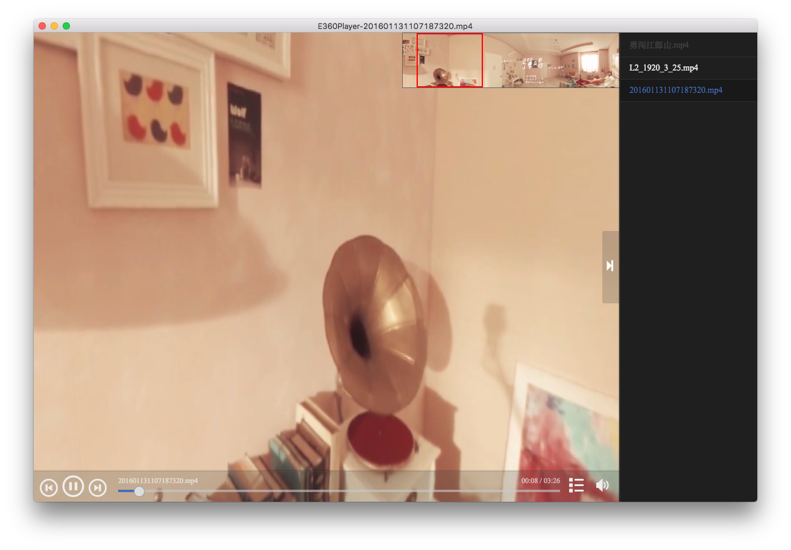

# E360Player

`E360Player` is the `360° Video Player ` with [electron](https://github.com/atom/electron).

## Screenshot

## Download

[百度云盘](http://pan.baidu.com/s/1RuHjg)

## Quick start

1. clone & run

        git clone git@github.com:liuhong1happy/E360Player.git
        cd E360Player
        npm install && npm start
    
2. release

        # osx 
        npm run pack-osx
        # windows 32
        npm run pack-win32
        # windows 64
        npm run pack-win64
        # linux
        npm run pack-linux

## Changelog

[Changelog.md](Changelog.md)

## License

The MIT License (MIT)

Copyright (c) 2016, Holly Liu